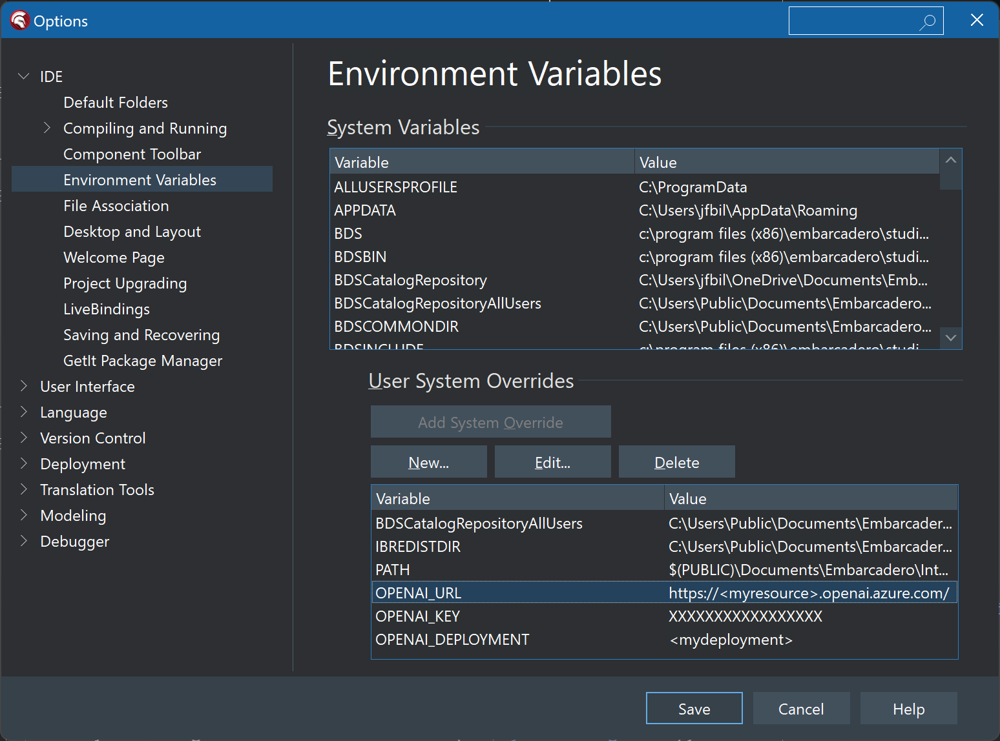

# Delphi Azure OpenAI Demo

## Quick start

1. If necessary, download and install [Embarcadero Delphi Community Edition (https://www.embarcadero.com/products/delphi/starter)](https://www.embarcadero.com/products/delphi/starter)

2. Start Delphi and open the project `delphi-console\MagnusLiber.dproj`

3. Configure the demo by using the `Tools`> `Options` > `IDE` > `Environment Variables` and edit the following environment variable:
  - `OPENAI_URL`
  - `OPENAI_KEY`
  - `OPENAI_DEPLOYMENT`

4. Click `Save`

5. Click `Run` or press `F9` on your keyboard.